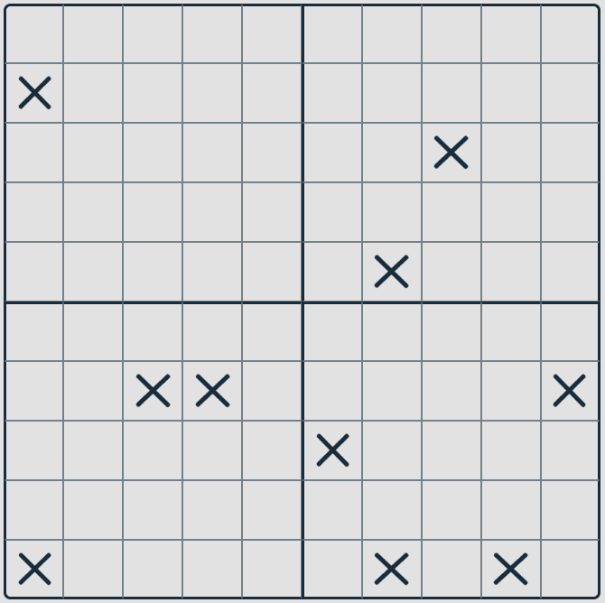
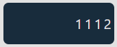

[](README.pt-br.md)
# Nanogram Game

Welcome to my Nonogram game! Nonograms are logic puzzles in which cells in a grid must be colored or left blank according to numbers at the side of the grid to reveal a hidden picture. This game is implemented in JavaScript.

## Contents

- [Features](#features)
- [Installation](#installation)
- [Usage](#usage)
- [Game Rules](#game-rules)

## Features

- Interactive and user-friendly interface.
- Dynamic grid generation based on puzzle size.
- Auto fill system to guide players.
- Restart functionality.
- Two levels options.
- Infinite random fases.

## Installation

To get a local copy up and running, follow these simple steps:

1. **Clone the repository**

```sh
git clone https://github.com/your-username/nonogram-game.git
```

2. **Open the project directory**

```sh
cd Nonogram
```

3. **Open index.html in your web browser**

```sh
start index.html
```

## Usage

Once you have the game open in your browser, you can start playing immediately. Here’s a brief overview of the interface and how to play:

1. **Grid Area:** This is where the puzzle is displayed. Click on the cells to fill them in.


2. **Number Hints:** These are the numbers on the top and left sides of the grid. They tell you how many cells in that row or column should be filled.


3. **Switch Buttons:** Use these to switch between square and X marker.


## How to Play

- Each number represents a group of consecutive filled cells.
- There must be at least one empty cell marked by an X between groups.
- Use logic to deduce which cells should be filled.

## Game Rules

1. **Objective:** The goal is to fill in the cells based on the number hints provided.

2. **Filling Cells:** Click on a cell to fill it. Select the X button to mark it with an 'X' if you think it should be blank.

3. **Hints:** The numbers outside the grid indicate how many filled cells are in each row or column.

4. **Lifes:** You have 4 chances to make a mistake, after which you must restart the level or start a different phase.
