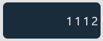

[](README.md)

# Nanogram Game

Bem vindo ao meu jogo Nonogram! Nonograms são puzzles de lógica em que quadrados de uma grade devem ser coloridos ou deixados em branco de acordo com números nas laterais da grade para revelar uma imagem oculta. Este jogo é implementado em JavaScript.

## Índice

- [Recursos](#recursos)
- [Instalação](#instalação)
- [Uso](#uso)
- [Como Jogar](#como-jogar)
- [Regras Do Jogo](#regras-do-jogo)

## Recursos

- Interface interativa e amigável.
- Geração dinâmica de grade baseada no tamanho no puzzle.
- Sistema de auto preenchimento para orientar os jogadores.
- Funcionalidade de reiniciar.
- Duas opções de níveis
- Fases aleatórias infinitas.

## Instalação

Para baixar uma cópia local e executar, siga os simples passos:

1. **Clone o repositório**

```sh
git clone https://github.com/your-username/nonogram-game.git
```

2. **Abra o diretório do projeto**

```sh
cd Nonogram
```

3. **Abra o arquivo index.html em seu navegador**

```sh
start index.html
```

## Uso

Uma vez que você tenha o jogo aberto no seu navegador, você pode começar a jogar imediatamente. Aqui está uma breve visão geral da interface e como jogar:

1. **Área da Grade:** Aqui é onde o puzzle é exibido. Clique nos quadrados para preenchê-los.


2. **Dicas Numéricas:** Estes são os números nas partes superior e esquerda da grade. Eles informam quantos quadrados naquela linha ou coluna devem ser preenchidos.


3. **Butões de Marcador:** Use-os para selecionar entre o marcador de quadrados e o de 'X'.


## Como Jogar

- Cada número representa uma quantidade consecutiva de quadrados preenchidos.
- Deve haver pelo menos um quadrado vazio marcado por 'X' entre cada grupo.
- Use a lógica para deduzir quais quadrados devem ser preenchidos.

## Regras do Jogo

1. **Objetivo:** O objetivo é preencher os quadrados com base nas dicas númericas fornecidas.

2. **Preenchimento de Quadrados:** Clique em um quadrado para preenchê-lo. Selecione o botão 'X' para marcá-lo se você achar que ele deve ficar vazio.

3. **Dicas:** Os números indicam quantos quadrados devem ser preenchidos em cada linha e coluna.

4. **Vidas:** Você tem 4 chances de errar, depois disso, você deve reiniciar a fase ou começar uma fase diferente.
